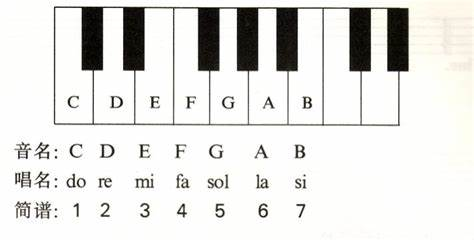

# 乐理

## 一、音与音高

* 声音是由物体振动产生的
* 音有**高低、强弱、长短、音色**等四种性质
* **音的高低**是由振动频率决定的
* **音的长短**是音的延续时间决定的
* **音的强弱**是由振幅的大小决定的
* **音的音色**是由于发音体的性质，形状及其泛音的多少决定的

* **乐音体系**：音乐中使用的，有固定音高的音的总和
* **音列**：乐音体系按照上行或下行的序列排列起来

* **音级**：乐音体系中的各个音，分为**基本音级**和**变化音级**

* 基本音级：七个具有独立名称的音级称为基本音级
* 变化音级：升高或降低基本音级得来的音，升高半音或者降低半音

## 二、音律

* 乐音体系中各音的绝对准确高度及其相互关系叫做**音律**

### 十二平均律

* 将八度分成十二个均等的部分的音律称为十二平均律
* 半音是最小的单位，两个半音是一个全音

### 五度相生律

画饼~

### 纯律

画饼~

## 三、记谱法

画饼~

## 四、调式

画饼~
