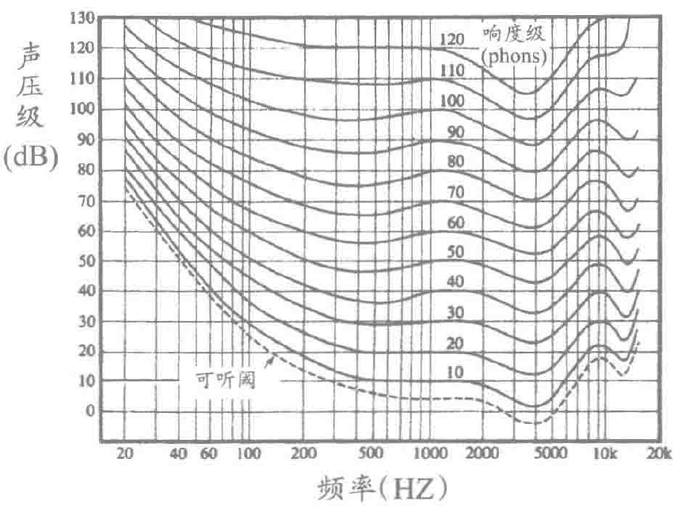

# 音乐声学基础

## 一、听觉系统对音高的识别

* **音高**`Pitch`是听觉系统对声音高度的一种认定，衡量一个人有没有音乐感，往往看他对音高的认知能力
* 人耳的可感知音域在$20 \sim 20000 \mathrm{Hz}$

## 二、听觉系统对音强的识别

* **声压**`Sound pressure`是声波产生的压力，单位是帕
* 声压级`Sound pressure level`公式为$20 \times \log_{10}(p/p_0)$
* 响度`Loudness`是指人耳听到的声音大小或强弱。
* 声压级相同的声音出现在不同音区时，听起来的响度会有差异，中高音区比较容易听到，低音区不容易听到(每日贝斯笑话)

* 声音强度会影响对于音高的感觉
* 音高上距离较近的纯音比较远的更容易发生掩蔽

> 当两个音的距离等于或小于一个全音时，就会发生掩蔽效应，当比较大的时候，就不会发生。

* 较高的乐音更容易被较低的音所掩蔽

> 钢琴上弹奏小二度音程，人们往往总是听到最低的那一个音

* 较强的声音可以掩蔽较宽的音域

>  唢呐，懂的都懂

## 三、听觉系统对音色的识别

### 3.1 定义及评价体系

* **音色**`Tone color`，乐音的品质特征，能够将音高、音强和音长都相同的两个音区别开来的一种声音属性，是一种最难描述的属性。

| 明亮度 |            音程            |
| :----: | :------------------------: |
| 清亮色 | 同度、八度、纯五度和纯四度 |
| 次亮色 |       大三度和大六度       |
|  暗色  |       小三度和小六度       |
| 浊亮色 |       大二度和大七度       |
| 浊暗色 |           小七度           |
|  浊色  |    三全音和一切增减和弦    |
| 重浊色 |           小二度           |

|  明亮度  |         和弦         |
| :------: | :------------------: |
|  明亮色  |       大三和弦       |
|  柔暗色  |       小三和弦       |
|  浊亮色  |  增三和弦、大七和弦  |
| 次浊暗色 |      大小七和弦      |
|  浊暗色  |      小小七和弦      |
|   浊色   | 减三和弦、减小七和弦 |
|  重浊色  |      减减七和弦      |

### 3.2 感知机理

* 声音在震动的时候会有谐音产生，谐音列的变化对于音色感觉的影响最大

总结出来了四条规律

* 包含简单谐音的乐音，大多听起来非常轻柔、悦耳，但是在低频段比较暗淡
* 带有6个以上谐音的乐音（比如钢琴、圆号和人声）听起来更丰满
* 含有奇数谐音的乐音（比如单簧管、管风琴），听起来比较空洞
* 带有很强的第6和第7号谐音的复合音，音色极其突出，听起来比较生涩、短促

### 3.3 影响音色感的客观因素

谐音列中各个序列的频率和强度会影响

