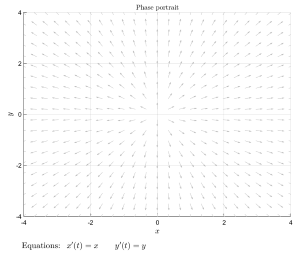
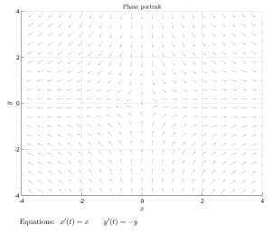
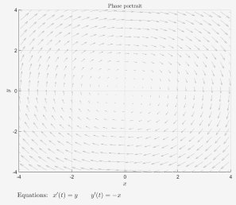
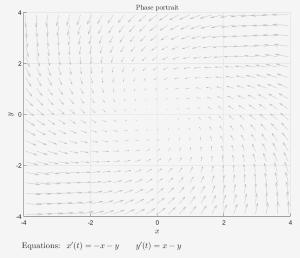

# 现代控制理论基础

[【Advanced控制理论】](https://www.bilibili.com/video/BV1yx411u7iX/?share_source=copy_web&vd_source=6fcbce3c943e3eb2d721be0364c24be)

## 一、状态空间

### 1.1 理论

* 在用状态空间法分析系统时，系统的动态特性是用由状态变量构成的一阶微分方程组来描述的
* 状态变量：一个系统可以用**最小个数**的一组变量为**状态变量**
* 状态矢量：如果$n$个状态变量用$x_1(t), x_2(t), \cdots , x_n(t)$表示，并把这些状态变量看作是矢量$x(t)$的分量，则$x(t)$称为**状态矢量**

$$
x(t) = \begin{pmatrix}
x_1(t)\newline
x_2(t)\newline
\vdots \newline
x_n(t) \newline
\end{pmatrix}
\mathrm{或}
x^T(t) = \begin{bmatrix}
x_1(t), & x_2(t), & \cdots , & x_n(t)
\end{bmatrix}
$$

* 状态空间：以状态变量$x_1(t), x_2(t),\cdots,x_n(t)$为坐标轴构建的$n$维空间，称为**状态空间**
* 状态方程：由系统的状态变量构成的**一阶微分方程组**称为系统的状态方程

$$
\dot{x} = Ax+bu
$$

* 输出方程：指定系统输出的情况下，该系统与状态变量间的函数关系，称为系统的**输出方程**

$$
y = cx
$$

* 状态空间表达式：状态方程和输出方程总和起来，构成对一个系统完整的动态描述称为系统的状态空间表达式

$$
\begin{matrix}
\dot{x}_1 = a_{11}x_1 + a_{12}x_2 + \cdots + a_{1n}x_n + b_1u\newline
\dot{x}_1 = a_{11}x_1 + a_{12}x_2 + \cdots + a_{1n}x_n + b_1u\newline
\vdots \newline
\dot{x}_1 = a_{11}x_1 + a_{12}x_2 + \cdots + a_{1n}x_n + b_1u\newline
\end{matrix}
$$

$$
\begin{matrix}
\dot{x} = Ax+bu\newline
y = cx
\end{matrix}
$$

* 其中，$x = \begin{pmatrix}
x_1 \newline x_2 \newline \vdots \newline x_n
\end{pmatrix}$为$n$维状态矢量;
* $A = \begin{pmatrix}
a_{11} & a_{12} & \cdots & a_{1n}\newline
a_{21} & a_{22} & \cdots & a_{2n}\newline
\cdots & \cdots &  & \cdots\newline
a_{n1} & a_{n2} & \cdots & a_{nn}\newline
\end{pmatrix}$为系统内部状态的联系，称为系统矩阵，为$n\times n$方阵;
* $b = \begin{pmatrix}
b_1 \newline b_2 \newline \vdots \newline b_n
\end{pmatrix}$为输入对状态的作用，称为输入矩阵或控制矩阵，这里为$n\times 1$的矩阵
* $c = \begin{pmatrix}
c_1, & c_2 & \cdots & c_n
\end{pmatrix}$为输出矩阵，这里是$1\times n$的矩阵

### 1.2 例子

以弹簧阻尼系统为例子，根据牛顿第二定律可以得到

$$
\begin{matrix}
    m\ddot{x} = f(x) - f_k - f_B \newline
    m\ddot{x} + B\dot{x} + kx = f(t)
\end{matrix}
$$

* 在经典控制理论中，使用`Laplace Transform`进行表达

$$
\begin{matrix}
ms^2X(s) + BsX(s) + kX(s) = F(s)\newline
G(x) = \frac{X(s)}{F(s)} = \frac{1}{ms^2 + Bs + k}
\end{matrix}
$$

* 在现代控制理论中，利用`state-space`来表示，利用**输入、输出、状态变量**的集合构成的**微分方程**来描述，对于二阶微分方程，需要两个状态变量来表征这个系统

$$
\begin{cases}
z_1 = x\newline
z_2 = \dot{x}
\end{cases}
\Rightarrow
\begin{cases}
\dot{z}_1 = \dot{x} = z_2\newline
\dot{z}_2 = \ddot{x}
\end{cases}
$$

代入上面的式子有

$$
\begin{cases}
\dot{z}_1 = z_2\newline
\dot{z}_2 = \frac{f(t)}{m} - \frac{k}{m}z_1 - \frac{B}{m}z_2 - f(t)
\end{cases}
$$

写成矩阵的形式有

$$
\begin{bmatrix}
\dot{z}_1 \newline
\dot{z}_2 \newline
\end{bmatrix} = \begin{bmatrix}
    0 & 1\newline
    -\frac{k}{m} & -\frac{B}{m}
\end{bmatrix} = \begin{bmatrix}
    z_1 \newline
    z_2
\end{bmatrix} + \begin{bmatrix}
    0 \newline
    \frac{1}{m}
\end{bmatrix} \begin{bmatrix}
    u(t)
\end{bmatrix}
$$

系统状态随着时间变化有

$$
y = \begin{bmatrix}
    1 & 0
\end{bmatrix} \begin{bmatrix}
    z_1 \newline
    z_2
\end{bmatrix} + \begin{bmatrix}
    0
\end{bmatrix} \begin{bmatrix}
    u(t)
\end{bmatrix}
$$

### 1.3 状态空间方程和拉普拉斯变换的关系

$$
\begin{cases}
    \dot{z} = Az + Bu\newline
    y = cz + Du
\end{cases} \rightleftarrows
G(s) = \frac{X(s)}{F(s)} = \frac{Y(s)}{u(s)} = \frac{1}{ms^2 + Bs + k}
$$

针对状态空间方程进行拉普拉斯变换，可以得到

$$
\begin{matrix}
    \begin{cases}
    \mathcal{L}(\dot{z}) = \mathcal{L}(Az + Bu) \newline
    sZ(s) = AZ(s) + BU(s) \newline
    (sI -A)Z(s) = BU(s) \newline
    Z(s) = (sI-A)^{-1}BU(s)
\end{cases} & \begin{cases}
    \mathcal{L}(y) = \mathcal{L}(cz+Du)\newline
    Y(s) = cZ(s) + DU(s)
\end{cases}
\end{matrix}
$$

$$
\begin{matrix}
    Y(s) = c(sI-A)^{-1}BU(s) + DU(s) \newline
    G(s) = \frac{Y(s)}{U(s)} = c(sI - A)^{-1}B + D
\end{matrix}
$$

先求解一下$(sI - A)^{-1}$的数值

$$
    sI-A = \begin{bmatrix}
        s & 0 \newline
        0 & s
    \end{bmatrix} - \begin{bmatrix}
        0 & 1 \newline
        -\frac{k}{m} & -\frac{B}{m}
    \end{bmatrix} = \begin{bmatrix}
        s & -1 \newline
        \frac{k}{m} & s + \frac{B}{m}
    \end{bmatrix}
$$

$$
(sI-A)^{-1} = \frac{(sI-A)^*}{|sI-A|} = \frac{\begin{bmatrix}
        s+\frac{B}{m} & 1\newline
        -\frac{k}{m} & s
    \end{bmatrix}}{s(s + \frac{B}{m})+ \frac{k}{m}} = \frac{\begin{bmatrix}
        s+\frac{B}{m} & 1\newline
        -\frac{k}{m} & s
    \end{bmatrix}}{s^2 + \frac{B}{m}s+\frac{k}{m}}
$$

$$
c(sI-A)^{-1}B = \begin{bmatrix}
    1 & 0
\end{bmatrix} \frac{\begin{bmatrix}
        s+\frac{B}{m} & 1\newline
        -\frac{k}{m} & s
    \end{bmatrix}}{s^2 + \frac{B}{m}s+\frac{k}{m}} \begin{bmatrix}
        0 \newline
        \frac{1}{m}
    \end{bmatrix}
$$

$$
c(sI-A)^{-1}B = \frac{1/m}{s^2+\frac{B}{m}s+\frac{k}{m}} = G(s)
$$

### 1.4状态空间方程的解

考虑下面的式子

$$
\begin{cases}
    \dot{x}_1(t) = x_1(t) + x_2(t)\newline
    \dot{x}_2(t) = 4x_1(t) - 2x_2(t)
\end{cases} \Rightarrow \frac{\mathrm{d}\vec{x}}{\mathrm{d}t} = A \vec{x}
$$

其中$A = \begin{bmatrix}
    1 & 1\newline
    4 & -2
\end{bmatrix}$

类比高等数学当中的求解一阶微分方程的方法，可以得到

$$
\vec{x}(t) = e^{At}\vec{x}(0)
$$

根据常识可以看出来$e^{At}$是一个$n\times n$的矩阵，从泰勒级数的方式来考虑

$$
e^{at} = 1 + at + \frac{1}{2!}(at)^2 + \frac{1}{3!}(at)^3 + \cdots + \frac{1}{n!}(at)^n
$$

$$
e^{At} = 1 + At + \frac{1}{2!}(At)^2 + \frac{1}{3!}(At)^3 + \cdots + \frac{1}{n!}(At)^n
$$

* 若$A = 0$，则$e^{AT}=I$
* 若$A = \begin{bmatrix}
    \lambda_1 & & & \newline
    & \lambda_2 & & \newline
    & & \ddots & \newline
    & & & & \lambda_n \newline
    \end{bmatrix}$，则$e^{At} = \begin{bmatrix}
    e^{\lambda_1t} & & & \newline
    & e^{\lambda_2t} & & \newline
    & & \ddots & \newline
    & & & & e^{\lambda_nt} \newline
    \end{bmatrix}$
* 若$A = P\Lambda P^{-1}$，则$e^{At}=Pe^{\Lambda t}P^{-1}$

求解状态空间方程的解

$$
\frac{\mathrm{d}\vec{x}(t)}{\mathrm{d}t} = A\vec{x}(t) + B\vec{u}(t)
$$

$$
e^{-At}\frac{\mathrm{d}\vec{x}(t)}{\mathrm{d}t}-Ae^{-At}\vec{x}(t) = e^{-At}B\vec{u}(t)
$$

$$
\int^t_{t_0} \frac{\mathrm{d}(e^{-A\tau}\vec{x}(\tau))}{\mathrm{d}\tau} \mathrm{d}\tau= \int^t_{t_0} e^{-A\tau}B\vec{u}(\tau)\mathrm{d}\tau
$$

$$
e^{-A\tau}\vec{x}(\tau)|^t_{t_0} = \int^t_{t_0} e^{-A\tau}B\vec{u}(\tau)\mathrm{d}\tau
$$

$$
e^{-At}\vec{x}(t) = e^{-At_0}\vec{x}(t_0) + \int^t_{t_0} e^{-A\tau}B\vec{u}(\tau)\mathrm{d}\tau
$$

$$
\vec{x}(t) = e^{A(t-t_0)}\vec{x}(t_0) + \int^t_{t_0}e^{A(t-\tau)}B\vec{u}(\tau)\mathrm{d}\tau
$$

* 第一项称为状态转移矩阵，其中$A$的特征值反应了这一项随着时间变化的趋势，如果所有的特征值均小于零，则有这一项最终变为零，这个是分析系统稳定性的一个方法

## 二、相图相轨迹

相图和相轨迹`Phase Portrait`是一种通过直观的图形分析微分方程，特别是微分方程的方法。

例如此式子的相图相轨迹为
$$
\begin{cases}
\dot{x}_1 = x_2 - 0.5 x_1\\
\dot{x}_2 = \sin x_1
\end{cases}
$$

分析一维情况利用下面的例子来举例子

* 可以看到当$x = \pm1$的时候，$\dot{x} = 0$
* 当$x< -1$的时候，会逐渐靠近$x\rightarrow-1$
* 当$-1 < x < 1$的时候，会逐渐靠近$x\rightarrow -1$
* 当$x > 1$的时候，会逐渐靠近$x\rightarrow + \infty$
* 所以$x = -1$是稳定点，$x = 1$是不稳定点

分析二维的情况

$$
\dot{x} = A x + Bu
$$

令$u = 0$

$$
\frac{\mathrm{d}}{\mathrm{d}t} \begin{bmatrix}
x_1 \\
x_2
\end{bmatrix} = \begin{bmatrix}
a & b\\
c & d\\
\end{bmatrix} \begin{bmatrix}
x_1 \\
x_2\\
\end{bmatrix}
$$

则有

$$
\begin{cases}
\dot{x}_1 = ax_1\\
\dot{x}_2 = dx_2\\
\end{cases} \begin{cases}
x_{10} = 0\\
x_{20} = 0\\
\end{cases}

$$

* case1:$a=d>0$​
* $(0,0)$点叫做`source`,是`unstable`不稳定点

* case2:$a > 0, d < 0$​
* $(0,0)$点叫做`saddle`

* case3：$a,d < 0$​
* $(0,0)$点叫做`sink`，是`stable`稳定点

进行一般形式的分析

$$
\dot{x} = Ax
$$

$$
\begin{matrix}
x = py\\
\dot{y} = \Lambda y
\end{matrix}
$$

* $x$的特征值决定了他的 

### 2.1总结

$$
\begin{cases}
\lambda_1 = a_1 + b_1i\\
\lambda_2 = a_2 + b_2i
\end{cases}
$$

* 当$a_1,a_2<0,b_1 = b_2 = 0$​，是`stable`

* 当$a_1 > 0,a_2 < 0, b_1 = b_2 = 0$​，是`saddle`

* 当$a_1,a_2>0,b_1 = b_2 = 0$​，是`unstable`

* 当$a_1 = a_2 = 0$​，是`center`

* 当$a_1,a_2>0$​,是`unstable`

* 当$a_1,a_2<0$​，是`stable`

## 系统的可控性

* 有一个离散系统

$$
\begin{array}{ll}
x_{k+1} &= Ax_k+Bu_k\\
x_1 &= Ax_0+Bu_0 = Bu_0\\
x_2 &= Ax_1 + Bu_1 = ABu_0+Bu_1\\
x_3 &=Ax_2+Bu_2 = A^2Bu_0+ABu_1+Bu_2\\
\vdots\\
x_n &= Ax_{n-1}+Bu_{n-1} = A^{n-1}Bu_0+\cdots+ABu_{n-2}+Bu_{n-1}
\end{array}
$$

$$
x_n = \begin{bmatrix}
B & AB & \cdots & A^{n-1}B
\end{bmatrix} \begin{bmatrix}
u_{n-1}\\
u_{n-2}\\
\vdots\\
u_0
\end{bmatrix} = Co \times u
$$

其中

$$
\begin{matrix}
A \in R^{n\times n}\\
B \in R^{n\times r}\\
Co \in R^{n\times nr}\\
\end{matrix}
$$

若$u$有解，则

$$
Rank(Co) = n
$$
