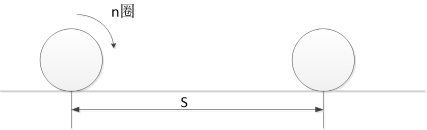
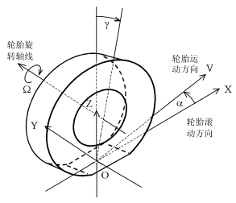

# 车辆动力学

## 第一章 轮胎模型

### 车辆侧向力学基础

#### （一）附着力、计算牵引力和牵引力

附着力：由作用在驱动轮上的转矩引起的，地面对车轮产生的能用于驱动车轮前进的**最大切向**力。

$$
\begin{array}{ll}
\mathrm{附着力} &= \mathrm{车轮的附着重} \times \mathrm{附着系数}\\
F_{\varphi} &= G_{\varphi} \cdot \varphi\\
\end{array}
$$

* 附着重：车轮受到的法向向下的载荷
* 附着系数：附着力与附着重的比值
* 附着率：地面对车轮的**驱动力**与附着重的比值
* 附着系数是最大驱动力和附着重的比重，附着率是驱动力与附着重的比值
* 附着系数同时与路面和车轮特性有关

计算牵引力$F_j$​​：由动力系统力矩计算得到的作用于车轮的牵引力（驱动力）。

* 当计算牵引力大于附着力的情况下，车轮会打滑

附着力、计算牵引力和牵引力$F$的关系

* 当$F_j < F_{\varphi}$时，$F = F_j$
* 当$F_j = F_{\varphi}$时，$F = F_\varphi$
* 当$F_j > F_{\varphi}$时，$F < F_j\;\;\;\;F=\mathrm{附着重}\times \mathrm{附着率}$​

车辆的加速度为

$$
a \leq \frac{F_{\varphi}}{m}=\frac{G_\varphi \cdot \varphi}{m} = \frac{G + F_{ag}}{m} \cdot \varphi
$$

* 当忽略空气对车辆的下压力$F_{ag}$时

$$
a \leq \varphi \cdot g
$$

#### （二）轮胎的三种半径

自由半径$R_0$：轮胎充足气，且不受外力时的半径

静力半径$R_s$：轮胎装到车上，车辆静止时，车轮中心到路面之间的垂向距离。

滚动半径$R$：根据车轮转动圈数n与实际车轮中心移动距离s之间的数学关系换算所得半径。

$$
R = \frac{s}{2 \pi n}
$$

#### （三）纯滚动、滑转与滑移

纯滚动$v = \omega R_0$

滑转$v < \omega R_0$

滑移$v > \omega R_0$

滑转情况下，滑转率$s = (\omega R_0 - v)/(\omega R_0)$

滑移情况下，滑移率$s = (v - \omega R_0)/v$

**滑转率**与**滑移率**统称为**滑动率**。

* 驱动情况下，滑动率为1，代表了车辆打滑
* 制动情况下，滑动率为1，代表了车辆抱死

前轮抱死时，$F_{y1}=0$，$F_{y2}$与$F_j$构成的力矩具有减小转向作用的能力，即使车辆失去转向能力，但汽车处于稳定状态。

后轮抱死时，$F_{y2}=0$，$F_j$与$F_{y1}$构成的力矩具有增大转向作用的能力，容易出现甩尾，汽车将急剧转动，处于不稳定状态。

#### （四）轮胎坐标系

车轮平面：垂直于车轮旋转轴的轮胎对称面

X轴：车轮平面与地面的交线，沿车辆前进方向为正

坐标原点O：X轴与车轮旋转轴线在地面投影线的交点

Z轴：过O点垂直于地面向上的线

Y轴：过O点，垂直于XOZ平面的线，方向与X、Z轴服从右手螺旋定则

侧偏角：轮胎前进方向与X轴的交角

#### （五）轮胎的侧偏特性

* 侧偏现象
* 侧偏特性

$$
F_Y = k_y \alpha
$$

$k_y$ -侧偏刚度

特点：总体呈非线性，但在小范围内接近线性关系；侧偏刚度随垂向载荷增大呈现先增大后减小的变化趋势

* 低速转向时，转向轮摆角可以很大，因此侧偏角对转向半径影响较小
* 高速转向时，转向轮摆角一般都很小，小于1度，此时侧偏角对转向半径的影响就很突出。

#### （六）回正力矩

* 车辆静止时受到的侧向力不会产生拖距
* 车辆运动时候会产生一定的拖距，从而产生回正力矩$M_z$
* 车辆受到侧向力较大的时候，轮胎拖距会变大
* 车辆受到的非常大的侧向力时候，拖距变小到为零

==此处插入一张图片==

* 回正力矩导致车辆的前轮的转向半径半大，导致后轮的转向半径变小

特点：

* 侧偏角增大，回正力矩呈现先增大后减小的变化趋势，当侧偏角增大到一定值后，回正力矩将变为负值
* 回正力矩与垂向载荷有关，载荷越大，侧偏刚度越大，则回正力矩越大。

### 1.2 轮胎纵滑和侧滑下的简化模型

轮胎模型的定义：

* 反应轮胎力学性能（所受侧向力、纵向力以及回正力矩等）与侧偏角和运动状态（滑转率和滑移率）关系的数学模型

#### （一）简化模型的假设条件

轮胎的四个组成部分

* 胎面层、带束层、胎体、轮辋

四个假设条件

* 胎体只存在沿y方向的变形，变形量为$y_b$
* 胎面存在x和y方向的变形,接地印迹各位置的纵向与侧向胎面变形刚度相同
* 沿x方向，接地印迹的最前与最后端到y轴的距离相等
* 在接地印迹内各点的运动方向一致

假设胎面上的一个点，从$A$点开始与地面接触，经过$t$时间后，运动到$P$点，则$P$位置的x方向为

$$
x'=vt \cos \alpha
$$

假设车轮作纯滚动，则该点从$A$处开始，经过$t$时间后运动到$H$位置，定义$H$位置的$x$方向坐标为$x$

在$P$点胎面沿$x$方向的变形量为$\Delta x=x'-x = vt\cos \alpha - x$

在$P$点胎面沿$y$方向的变形量为$\Delta y=vt\sin \alpha$

在制动工况下

* 定义变量-制动滑移率$s_b$(brake)

$$
s_b = \frac{\Delta x}{x'} = \frac{\Delta x}{x + \Delta x} \Rightarrow \Delta x = \frac{s_b}{1-s_b}x
$$

$$
\begin{array}{ll}
    \Delta y &= vt\sin \alpha\\
    &= vt \cos \alpha \cdot \tan \alpha\\
    &= x' \cdot \tan \alpha\\
    &= \Delta x / s_b \cdot \tan \alpha\\
    &= 1/s_b \cdot s_b / (1 - s_b) x \cdot \tan \alpha\\
    &= 1/(1 - s_b)x \cdot \tan \alpha
\end{array}
$$

在驱动工况下

* 在驱动工况下$\Delta x = x' - x < 0$
* 定义变量-驱动滑转率$s_d$(drive)

$$
s_d = -\frac{\Delta x}{x}
$$

$$
\Delta y = \tan \alpha (1-s_d)x
$$

通过推导可以得出

$$
s_x = \frac{s_b}{1 - s_b} = -s_d
$$

$$
s_y = \frac{\tan \alpha}{1 - s_b} = \tan \alpha (1 - s_d)
$$

### 1.3 轮胎侧偏特性的半经验模型

* 特点：半经验模型是反应轮胎侧偏特性的稳态模型，其不能反应出轮胎的动态响应特性

### 1.4 轮胎的swift模型

* 考虑了轮胎环和轮辋之间的变形阻尼
* 考虑了胎体左右两个面之间的变形刚度和阻尼
* 考虑接地处沿垂线方向、侧向以及纵向的变形，在接地处引入了垂向、侧向以及纵向的刚度
* 轮胎接地处的侧偏模型采用了“魔术”模型，以模式模型计算出来的力和力矩作为轮胎动力学模型的输入

## 第二章 悬架系统特性

* **悬架的构成**

弹性原件（弹簧）：缓冲能量

阻尼元件（减震器）：消耗能量

导向杆系（连杆）：运动协调

* **悬架的类型**

根据左右两个半桥是否联结在一起，区分为非独立悬架和独立悬架。

独立悬架中根据横臂的数量又可分为单横臂和双横臂独立悬架。

### 2.1 扭杆弹簧

特点：结构简单、工作可靠、单位质量变形能大，在履带车辆和轮式车辆上有着广泛应用

可以看出，当车辆在转向的情况下，车辆存在一个抵抗车辆侧倾的角度

#### （一）主要参数

* $d$-扭杆直径
* $L$-扭杆工作长度
* $a$-摇臂长度
* $\alpha_0$-摇臂的初始安装位置与水平线的夹角
* $\alpha$-车轮受力后摇臂与水平线的夹角，规定在水平线以下为正，水平线以上为负
* $s$-车轮垂向位移
* $F$-车轮垂向所受外力

#### （二）刚度分析

$$
T_w = F a \cos \alpha
$$

$$
T_n = \frac{GJ\theta}{L} = \frac{GJ(\alpha_0 - \alpha)}{L}
$$

其中：

$$
J = \frac{\pi d^4}{32}
$$

$$
\begin{matrix}
    T_w = T_n\\
    F = \frac{GJ}{La\cos\alpha}(\alpha_0 - \alpha)
\end{matrix}
$$

$$
s = a(\sin \alpha_0 - \sin \alpha)
$$

$$
K = \frac{dF}{ds} = \frac{dF/d\alpha}{ds/d\alpha} = \frac{G\pi d^4}{32La^2}\frac{1-(\alpha_0 - \alpha)tg\alpha}{\cos^2 \alpha}
$$

可以看出当$\alpha = 0$的时候，力臂最长，刚度最小

#### （三）扭杆弹簧刚度的影响因素

* 扭杆直径$d$越大，刚度越大
* 扭杆工作长度$L$越大，刚度越小
* 摇臂长度$a$越长，刚度越小
* 工作位置$\alpha$的影响

### 2.2 油气弹簧

#### 2.2.1 油气弹簧概述

* 不同路面对悬架刚度的需求不同：好的路面需要弹簧刚度小一些，坏路面要求弹簧刚度要大一些，因此需要车辆
在动行程大的时候，刚度大一些，动行程小的时候刚度小一些

* 系统组成：由油室、气室和活塞组成
* 工作介质：液压油，气体
* 工作过程：当车轮向上运动时，其将带动活塞网上运动，活塞推动液压油压缩气室中气体，气体受压后体积变小，压力增大，并与负载平衡。
* 油气弹簧的优点：悬架动行程小时，其刚度小；动行程大时，其刚度也大；带阻尼阀的油气弹簧，具有减振器的功能，可以省去单独的减振器
* 油气弹簧的分类：**气室数量**：单气室油气弹簧，双气室油气弹簧、具有反压气室的油气弹簧、可调式油气弹簧
* 双气室油气弹簧的工作过程：当动行程较小时，低压气室工作；当动行程较大时，高、低压气室共同参与工作
* 具有反压气室的油气弹簧工作过程：压缩行程时，一个气室受压，压力升高，而另一个气室体积膨胀，压力减小；反行程时，过程相反
* 反压气室的特点：可以阻碍车轮的快速下落，解决单气室油气弹簧反行驶工作时活塞易脱缸的问题
* 可调式油气弹簧的特点：能实现位姿调节，提高车辆的通过性

#### 2.2.2 单气室油气弹簧

##### 主要参数

* $A_e$-主活塞的面积
* $V_0,p_0,h_0$-气室的初始体积、初始气压和初始气柱高度，$h_0 = V_0 / A_e$
* $V,p$-活塞运动$s$之后，气室的体积和压力

##### 刚度推导

$$
K = \frac{dF}{ds}
$$

根据热力学基本定律可以得到

$$
p_0V_0^m = pV^m = C
$$

$$
\frac{p}{p_0} = (\frac{V_0}{V_0 - \Delta V})^m = \frac{1}{(1-\frac{sA_e}{h_0A_e})^m}
$$

$$
F = pA_e = A_ep_0(1-\frac{s}{h_0})^{-m}
$$

$$
K = \frac{dF}{ds} = \frac{p_0 A_e m}{h_0}(1-\frac{s}{h_0})^{-(m+1)}
$$

## 第三章 转向轮和前轴的横摆

### 3.1 陀螺效应

#### （一）定义

力学中的陀螺就是除能绕自转轴线转动外，还能绕其他轴线转动的刚体

#### （二）陀螺的自转动量矩

* 质点动量矩：质点动量对转动轴之矩，表达式为

$$
H = r \times mv = r \times m(\Omega \times r) = m |r|^2 \Omega
$$

$r$-质点到转动轴的矢径
$v$-质点的速度矢量

$\Omega$-质点绕转动轴的角速度矢量

* 陀螺自转动量矩：陀螺对自转轴线的动量矩

$$
H = \sum_{i} m_i |r_i|^2 \Omega = I\Omega
$$

方向与自转角速度方向相同

#### （三）陀螺的动量矩定理

* 陀螺对主轴公转质点O的动量矩定理：绕共轴支点O转动的陀螺，其对O点的动量矩变化率等于作用在陀螺上的锁喉外力对O点的力矩的代数和

$$
\frac{dL}{dt} = M
$$

对于高速转动的陀螺，陀螺对公转支点O的动量矩L，可近似用陀螺对自转轴线的动量矩H来代替。

$$
\frac{dL}{dt} = M \Rightarrow \frac{dH}{dt} = M
$$

若没有外力的情况下，角动量矩守恒

## 第七章 关键部件动力学模型

### 发动机激励模型

发动机激励转矩 = 平均转矩 + 波动转矩

